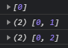
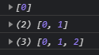
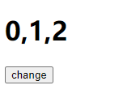
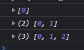

## 预先了解 setState 的两种传参方式

### 1、直接传入新值 setState(options);

列如：

```js
const [state, setState] = useState(0);
setState(state + 1);
```

### 2、传入回调函数 setState(callBack);

例如：

```js
const [state, setState] = useState(0);
// prevState 是改变之前的 state 值，return 返回的值会作为新状态覆盖 state 值
setState((prevState) => prevState + 1);
```

## useState 异步回调获取不到最新值及解决方案

通常情况下 setState 直接使用上述第一种方式传参即可，但在一些特殊情况下第一种方式会出现异常；
例如希望在异步回调或闭包中获取最新状态并设置状态，此时第一种方式获取的状态不是实时的，React 官方文档提到：组件内部的任何函数，包括事件处理函数和 Effect，都是从它被创建的那次渲染中被「看到」的，所以引用的值任然是旧的，最后导致 setState 出现异常：

```js
import React, { useState, useEffect } from "react";

const App = () => {
  const [arr, setArr] = useState([0]);

  useEffect(() => {
    console.log(arr);
  }, [arr]);

  const handleClick = () => {
    Promise.resolve()
      .then(() => {
        setArr([...arr, 1]); // 此时赋值前 arr 为：[0]
      })
      .then(() => {
        setArr([...arr, 2]); // 此时赋值前 arr 为旧状态仍然为：[0]
      });
  };

  return (
    <>
      <button onClick={handleClick}>change</button>
    </>
  );
};

export default App;
```

上面代码，App 组件实际也是个闭包函数，handleClick 里面引用着 arr，第一次 setArr 后 arr 的值确实更新了，我们也可以在下面截图中看到，但此次执行的 handleClick 事件处理函数作用域还是旧的，里面引用的 arr 仍然为旧的，导致第二次 setArr 后结果为 [0, 2]：



在 class 组件中我们可以使用 setState(options, callBack); 在 setState 的第二个参数回调函数中再次进行 setState，也不存在闭包作用域问题，但是 React Hook 中 useState 移除了 setState 的第二个参数，而且若嵌套太多也不佳；

### 解决方案 1（推荐使用）：

将上述代码使用第二种（回调）方式传参

```js
const handleClick = () => {
  Promise.resolve()
    .then(() => {
      // 这里也可以不改，使用第一中传参方式 setArr([...arr, 1]); 因为这里不需要获取最新状态
      setArr((prevState) => [...prevState, 1]);
    })
    .then(() => {
      // 这里必须改成回调函数传参方式，否则会读取旧状态，导致异常
      setArr((prevState) => [...prevState, 2]);
    });
};
```



### 解决方案 2：

使用 useReducer 仿造类组件中的 forceUpdate 实现组件强制渲染；

**注意：** 此方案仅限于只有页面依赖该数据时适用，如果有类似 useEffect 等 hook 在监听该数据(示例中的 arr )时无法实时捕捉到变化

```js
import React, { useState, useReducer } from "react";

const App = () => {
  const [arr, setArr] = useState([0]);
  const [, forceUpdate] = useReducer((x) => x + 1, 0);

  const handleClick = () => {
    Promise.resolve()
      .then(() => {
        arr.push(1); // 如果这里也需要做一次渲染在改变状态后调用 forceUpdate() 即可
      })
      .then(() => {
        arr.push(2);
        forceUpdate();
      });
  };

  return (
    <>
      <h1>{arr.toString()}</h1>
      <button onClick={handleClick}>change</button>
    </>
  );
};

export default App;
```

点击前：


点击后：



### 解决方案 3：

利用 ref ，state 发生改变同时将值映射到 ref
ref 的改变不会触发页面更新，但在异步中一定能拿到最新值，所以需要在页面上用就使用 state，在异步逻辑中用就使用 ref

```js
import React, { useState, useRef, useEffect } from "react";

const App = () => {
  const [arr, setArr] = useState([0]);
  let ref = useRef();
  useEffect(() => {
    ref.current = arr;
    console.log(arr);
  }, [arr]);

  const handleClick = () => {
    Promise.resolve()
      .then(() => {
        const now = [...ref.current, 1];
        ref.current = now;
        setArr(now);
      })
      .then(() => {
        setArr([...ref.current, 2]);
      });
  };

  return (
    <>
      <h1>{arr.toString()}</h1>
      <button onClick={handleClick}>change</button>
    </>
  );
};

export default App;
```



### 终极方案：

上面例 3 这类方式可以自己封装一个 hooks 将 state 和 ref 进行关联，同时再提供一个方法供异步中获取最新值使用，例如：

```js
const useGetState = (initVal) => {
  const [state, setState] = useState(initVal);
  const ref = useRef(initVal);
  const setStateCopy = (newVal) => {
    ref.current = newVal;
    setState(newVal);
  };
  const getState = () => ref.current;
  return [state, setStateCopy, getState];
};

const App = () => {
  const [arr, setArr, getArr] = useGetState([0]);
  useEffect(() => {
    console.log(arr);
  }, [arr]);

  const handleClick = () => {
    Promise.resolve()
      .then(() => {
        setArr([...getArr(), 1]);
      })
      .then(() => {
        setArr([...getArr(), 2]);
      });
  };

  return (
    <>
      <h1>{arr.toString()}</h1>
      <button onClick={handleClick}>change</button>
    </>
  );
};
```

这样看起来更加易于阅读，异步中获取最新值就通过调用 getArr，同时 ahooks 中也同样提供了这种 hooks [https://ahooks.js.org/zh-CN/hooks/use-get-state/](https://ahooks.js.org/zh-CN/hooks/use-get-state/)，或者是另一种： [https://ahooks.js.org/zh-CN/hooks/use-latest/](https://ahooks.js.org/zh-CN/hooks/use-latest/)，其原理都大同小异。

最后在附上官方相关解释文档：[为什么我会在我的函数中看到陈旧的 props 和 state ？](https://zh-hans.reactjs.org/docs/hooks-faq.html#why-am-i-seeing-stale-props-or-state-inside-my-function)
