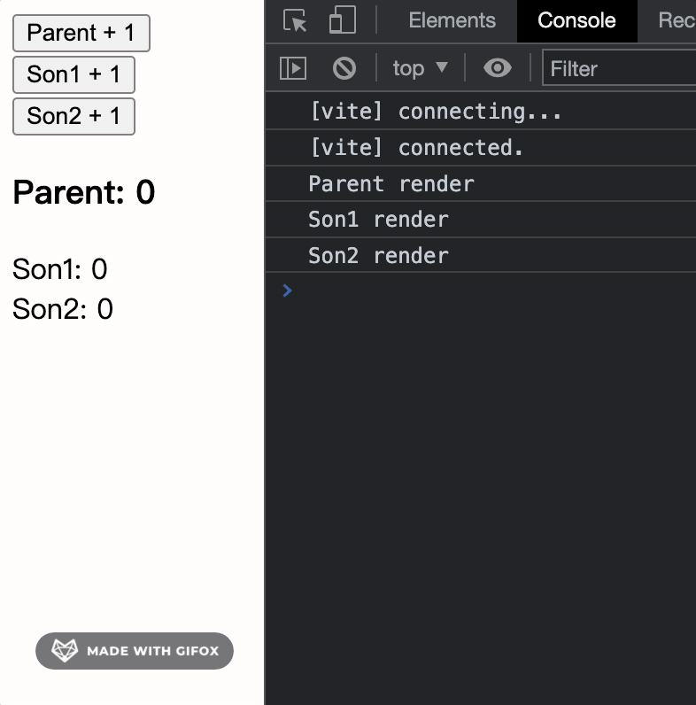
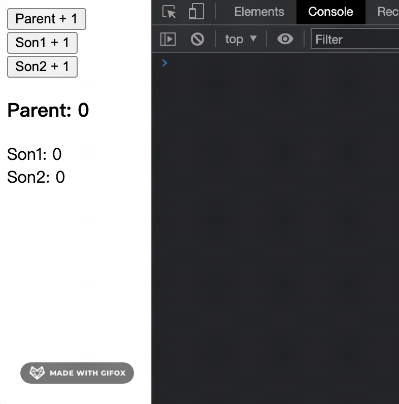
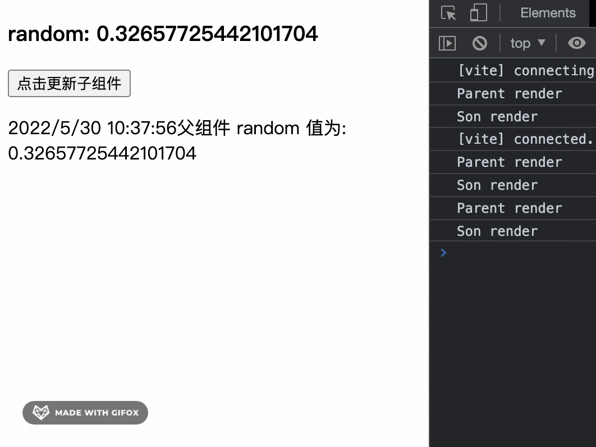
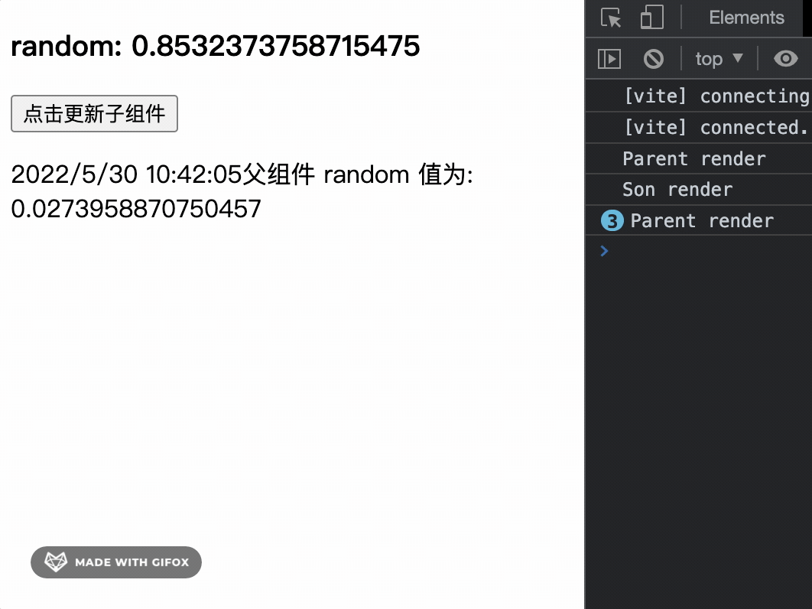
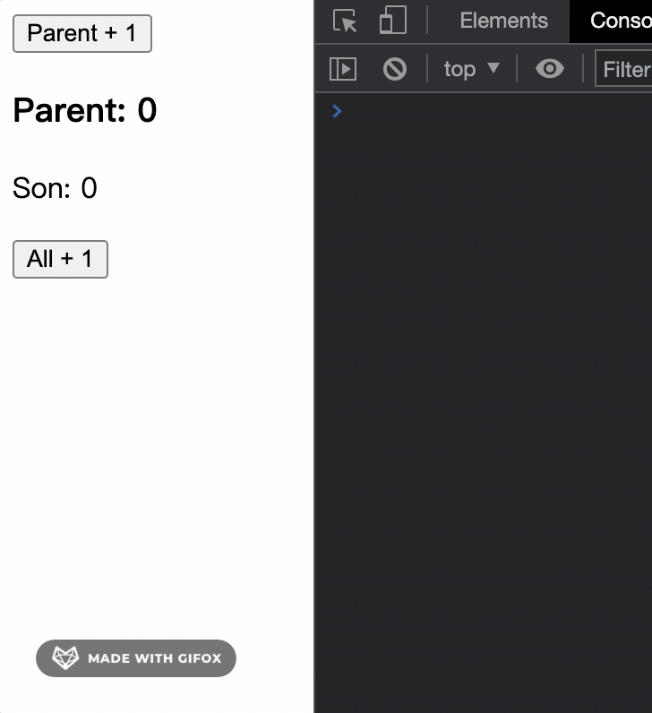
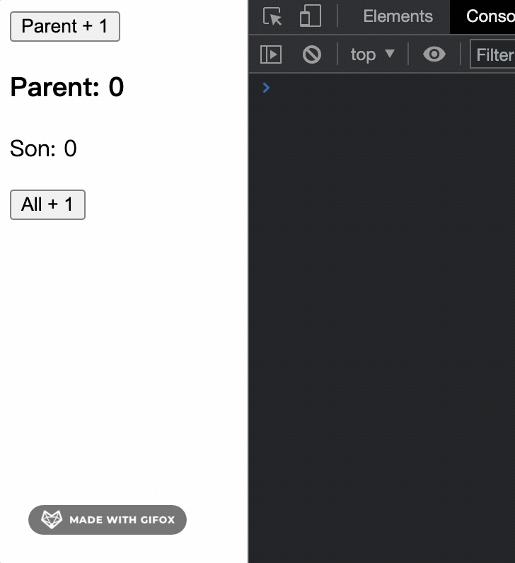
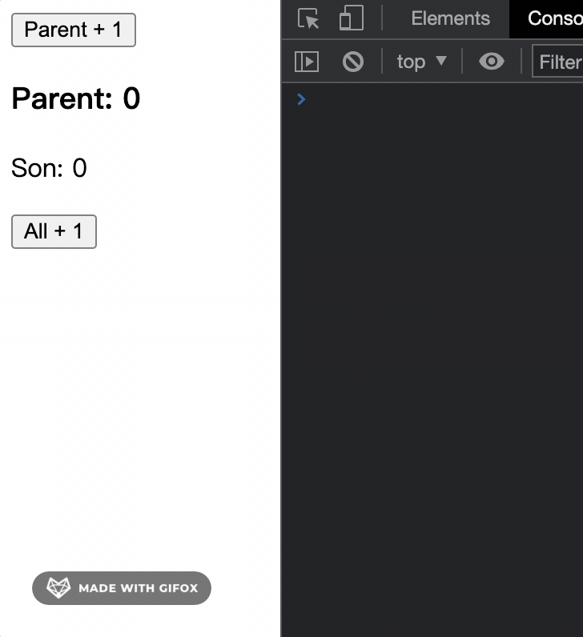
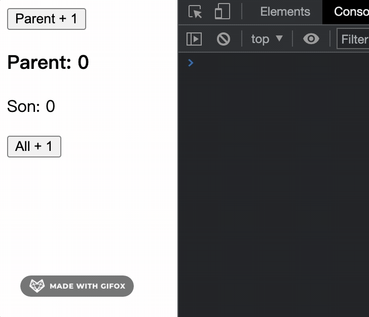

## 前言

在 React 开发中如果不去管组件的重复渲染问题，项目稍微复杂一点性能将不堪入目，下面将介绍项目中最常见的例子及解决方案（仅 hooks 组件）。

## 预先了解所用知识

1. React.memo
2. React.useCallback
3. React.useMemo
4. [useMemoizedFn](https://ahooks.js.org/zh-CN/hooks/use-memoized-fn/)（利用 ref + useMemo 配合单例模式实现比 useCallback 更加好用的 hook，下面会提，推荐尝试）

没错，只需使用上面 4 点即可解决大多数组件重复渲染问题，而如何合理去使用呢？

## 例 1: 父组件状态更新导致子组件无效渲染

```js
const Parent = () => {
  const [count, setCount] = useState(0);
  const [son1Count, setSon1Count] = useState(0);
  const [son2Count, setSon2Count] = useState(0);
  return (
    <div>
      {console.log("Parent render")}
      <button onClick={() => setCount((v) => v + 1)}>Parent + 1</button>
      <button onClick={() => setSon1Count((v) => v + 1)}>Son1 + 1</button>
      <button onClick={() => setSon2Count((v) => v + 1)}>Son2 + 1</button>
      <h3>Parent: {count}</h3>
      <Son1 son1Count={son1Count} />
      <Son2 son2Count={son2Count} />
    </div>
  );
};
const Son1 = (props) => {
  return (
    <div>
      {console.log("Son1 render")}
      Son1: {props.son1Count}
    </div>
  );
};
const Son2 = (props) => {
  return (
    <div>
      {console.log("Son2 render")}
      Son2: {props.son2Count}
    </div>
  );
};
```


可以看出，无论改变哪个值，所有组件都重新渲染了，理想情况是改变 count 值实际并不需要 Son1 和 Son2 组件重新渲染，改变 son1Count 也不需要 Son2 重新渲染，简而言之就是子组件所依赖的值没发生变化就不需要重新渲染，上面情况只需将子组件用 React.memo 包裹即可:

```js
const Son1 = React.memo((props) => {
  return (
    <div>
      {console.log("Son1 render")}
      Son1: {props.son1Count}
    </div>
  );
});
const Son2 = React.memo((props) => {
  return (
    <div>
      {console.log("Son2 render")}
      Son2: {props.son2Count}
    </div>
  );
});
```


可以看到轻松包裹一下就已经达到理想效果，React.memo 本质就是一个高阶组件(HOC)，通过浅比较(比较栈内存中的值) props、state 和 render 的内容来判断是否需要重新渲染组件。而有时候子组件不得不依赖父组件的值，但这个依赖的值发生改变又不需要重新渲染组件怎么办，接着看下面例 2。

## 例 2: 自定义子组件是否重新渲染

```js
const Parent = () => {
  const [random, setRandom] = useState(Math.random());
  const [nowTime, setNowTime] = useState(new Date().toLocaleString());
  const timerRef = useRef();
  useEffect(() => {
    timerRef.current = setInterval(() => {
      setRandom(Math.random());
    }, 1000);
    return () => {
      clearInterval(timerRef.current);
    };
  });
  return (
    <div>
      {console.log("Parent render")}
      <h3>random: {random}</h3>
      <button onClick={() => setNowTime(new Date().toLocaleString())}>
        点击更新子组件
      </button>
      <Son random={random} nowTime={nowTime} />
    </div>
  );
};
const Son = React.memo((props) => {
  return (
    <div>
      {console.log("Son render")}
      <p>
        {props.nowTime}父组件 random 值为: {props.random}
      </p>
    </div>
  );
});
```


上面例子中，子组件依赖父组件 random 和 nowTime，而子组件理想是在点击按钮 nowTime 发生改变后 才重新渲染组件显示 random 的值，不需要上面那样实时渲染，此时只需要在 React.memo 第二个参数自定义渲染规则即可，React.memo 第二个参数为可选参数：

```ts
function memo<P extends object>(
  Component: FunctionComponent<P>,
  propsAreEqual?: (
    prevProps: Readonly<PropsWithChildren<P>>,
    nextProps: Readonly<PropsWithChildren<P>>
  ) => boolean
): NamedExoticComponent<P>;
```

看函数签名可知，第二个参数可传一个回调函数，回调函数会有两个形参，props 状态改变前的值和改变后的值，返回值为一个布尔值，true 禁止重新渲染，false 将重新渲染，和以往 class 组件中的 shouldComponentUpdate 生命周期钩子用法很像，下面加入自定义渲染判断条件，即只在 props.nowTime 发生改变时进行重新渲染:

```js
const Son = React.memo(
  (props) => {
    return (
      <div>
        {console.log("Son render")}
        <p>
          {props.nowTime}父组件 random 值为: {props.random}
        </p>
      </div>
    );
  },
  (prevProps, nextProps) => prevProps.nowTime === nextProps.nowTime
);
```


从上图可见只有 props.nowTime 发生改变才会重新渲染。第二个参数的判断规则在实际开发中还有很多妙用，比如一些情况可以替代 useCallback，后面会提一下。

## 例 3: 向子组件传递方法(状态提升)导致子组件无效渲染

```js
const Parent = () => {
  const [count, setCount] = useState(0);
  const [sonCount, setSonCount] = useState(0);
  const allPlus = () => {
    setCount((v) => v + 1);
    setSonCount((v) => v + 1);
  };
  return (
    <div>
      {console.log("Parent render")}
      <button onClick={() => setCount((v) => v + 1)}>Parent + 1</button>
      <h3>Parent: {count}</h3>
      <Son allPlus={allPlus} sonCount={sonCount} />
    </div>
  );
};
const Son = React.memo((props) => {
  return (
    <div>
      {console.log("Son render")}
      <p>Son: {props.sonCount}</p>
      <button onClick={props.allPlus}>All + 1</button>
    </div>
  );
});
```


从控制台输出可以看见，当传递一个方法给子组件时，就算使用 React.memo 进行包裹也不济于事，导致该问题出现的根本原因是当 count 发生改变导致父组件发生重新渲染，Parent 组件本质也是一个函数，所以 `const allPlus = () => { setCount(count + 1); setSonCount(sonCount + 1); };` 也会重新执行一次，这就意味着 allPlus 已经重新赋值，此时虽然看起来没什么变化，实际上 allPlus 在栈内存中的地址已经改变，而 React.memo 默认正是通过浅比较决定是否重新渲染，也就导致只要父组件发生重绘，子组件一定会跟着无效重绘。
使用 React.useCallback 缓存函数解决子组件无效渲染，只需将上面 allPlus 方法使用 useCallback 包裹：

```js
const allPlus = useCallback(() => {
  setCount((v) => v + 1);
  setSonCount((v) => v + 1);
}, []);
```



```ts
function useCallback<T extends (...args: any[]) => any>(
  callback: T,
  deps: DependencyList
): T;
```

从 useCallback 函数签名看到，需要传递两个参数，第一个传需要缓存的函数，第二个是依赖值，其本质就是返回的是一个 memoized（缓存）函数，在依赖不变的情况下，多次定义的时候，返回的值是相同的，他的实现原理是当使用一组参数初次调用函数时，会缓存参数和计算结果，当再次使用相同的参数调用该函数时，会直接返回相应的缓存结果，上面例子依赖值为空数组，所以无论怎样 allPlus 栈内存值都不会变，也就不会触发子组件无效重绘。
在向子组件传递方法时在项目中很多时候会懒得专门声明一个函数绑定到子组件，例如：

```js
<Son
  onClick={() => {
    setCount((v) => v + 1);
    setSonCount((v) => v + 1);
  }}
  sonCount={sonCount}
/>
```

如果不会有性能影响自然无所谓，但若是触发无效重绘就需要考虑了。
**注意:** 依赖值一定要谨慎处理，根据实际情况设定，例如上面例子 allPlus 中 setState 都是采用回调函数传参，假如改成直接传参，而又不给定依赖值，就会造成缓存的函数中无法获取最新值，例如上述例子 allPlus 改为：

```js
const allPlus = useCallback(() => {
  setCount(count + 1);
  setSonCount(sonCount + 1);
}, []);
```


很明显看到 All + 1 后 setCount 中 count 并不是最新值，而是上一次缓存函数时的值，所以缓存函数在添加依赖时需要视情况而定，否则出现 bug 排查起来时可能会令人头痛不已，

### 推荐尝试 useMemoizedFn

上面 useCallback 解决的问题可以被 ahooks 中的 [useMemoizedFn](https://ahooks.js.org/zh-CN/hooks/use-memoized-fn/)（点击[useMemoizedFn](https://ahooks.js.org/zh-CN/hooks/use-memoized-fn/)去看官方例子）完全替代，只需要将上面的 allPlus 方法使用 useMemoizedFn 进行包裹即可，并且不需要传依赖，这个 hook 设计很好，React 官方提案弄个 useEvent 我想就类似 useMemoizedFn 这种了吧，看看它的源码：

```js
function useMemoizedFn(fn) {
  if (process.env.NODE_ENV === "development") {
    // 测试环境参数类型判断
    if (!utils_1.isFunction(fn)) {
      console.error(
        "useMemoizedFn expected parameter is a function, got " + typeof fn
      );
    }
  }

  var fnRef = react_1.useRef(fn); // why not write `fnRef.current = fn`?
  // https://github.com/alibaba/hooks/issues/728
  // 这里相当巧妙的利用 Ref 配合 useMemo 去缓存方法使内部能拿到最新值还不用传手动传依赖
  fnRef.current = react_1.useMemo(
    function () {
      return fn;
    },
    [fn]
  );
  var memoizedFn = react_1.useRef();
  // 这里使用单例模式让返回出去的方法实例化后引用地址永远不变，在调用的时候再去用上面的 fnRef，
  // 不仅解决了重复渲染，连内部引用状态更新都不用重复渲染，这设计的确厉害。
  if (!memoizedFn.current) {
    memoizedFn.current = function () {
      var args = [];

      for (var _i = 0; _i < arguments.length; _i++) {
        args[_i] = arguments[_i];
      }

      return fnRef.current.apply(this, args);
    };
  }

  return memoizedFn.current;
}
```

## 例 4: 妙用 React.memo 或 React.useMemo 防止子组件无效渲染

将例 3 中 allPlus 方法不使用 useCallback 缓存，通过子组件 React.memo 第二个参数自定义渲染规则达到目的：

```js
const Parent = () => {
  const [count, setCount] = useState(0);
  const [sonCount, setSonCount] = useState(0);
  const allPlus = () => {
    setCount((v) => v + 1);
    setSonCount((v) => v + 1);
  };
  return (
    <div>
      {console.log("Parent render")}
      <button onClick={() => setCount((v) => v + 1)}>Parent + 1</button>
      <h3>Parent: {count}</h3>
      <Son allPlus={allPlus} sonCount={sonCount} />
    </div>
  );
};
const Son = React.memo(
  (props) => {
    return (
      <div>
        {console.log("Son render")}
        <p>Son: {props.sonCount}</p>
        <button onClick={props.allPlus}>All + 1</button>
      </div>
    );
  },
  (prevProps, nextProps) => prevProps.sonCount === nextProps.sonCount
);
```


使用 useMemo 缓存 allPlus 方法，useMemo 和 useCallback 一样第一个参数传回调函数，第二个传依赖值，它们不同的地方在于 useMemo 缓存的是第一个参数回调函数的返回值，而 useCallback 直接缓存第一个参数，也就是回调函数：

```js
const Parent = () => {
  const [count, setCount] = useState(0);
  const [sonCount, setSonCount] = useState(0);
  const allPlus = useMemo(
    () => () => {
      // 注意这里不同于 useCallback
      setCount((v) => v + 1);
      setSonCount((v) => v + 1);
    },
    []
  );
  return (
    <div>
      {console.log("Parent render")}
      <button onClick={() => setCount((v) => v + 1)}>Parent + 1</button>
      <h3>Parent: {count}</h3>
      <Son allPlus={memoizedAllPlus} sonCount={sonCount} />
    </div>
  );
};
const Son = React.memo((props) => {
  return (
    <div>
      {console.log("Son render")}
      <p>Son: {props.sonCount}</p>
      <button onClick={props.allPlus}>All + 1</button>
    </div>
  );
});
```

这样也能达到效果，但不建议这样操作，因为 useMemo 在设计上实际用处在于缓存数据，例如对一个很大的数据做二次处理，避免每次渲染做无意义的计算导致性能降低，而 useCallback 才是为缓存函数而生。

## 总结

虽然看上去只用了 React.memo、React.useCallback、React.useMemo 这三个，甚至 React.useMemo 都算不上就能处理组件的重复渲染问题，但在实际操作过程中考虑的因素也不少，当然有时候甚至也可以不用去管重复渲染问题，例如一个页面中组件拆分的少，业务并不复杂，此时看见函数就去缓存，看见组件就用 React.memo 包裹，这样性能没什么变化反而是画蛇添足。另外若项目复杂但盲目大量的去使用 React.memo、React.useCallback、React.useMemo，依赖值或判断规则不去综合实际情况处理，在 debug 时很可能会让人痛不欲生且还会有内存泄露风险，所以状态提升方面还是比较建议合理尝试下 ahooks 中的[useMemoizedFn](https://ahooks.js.org/zh-CN/hooks/use-memoized-fn/)，源码也就那么几句，确有如此大作用！
