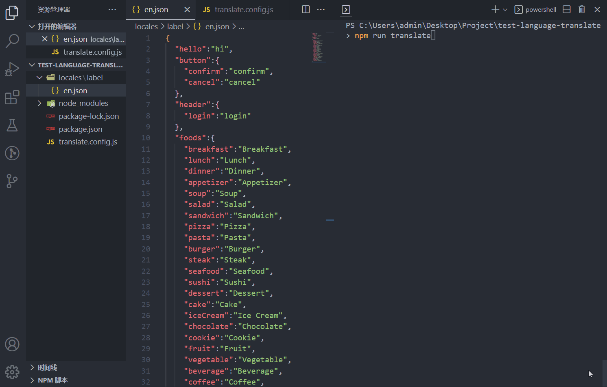

## 前言
在需要国际化的项目中经常会遇到写完代码后需要将文案翻译到其他很多国家语言，人工翻译再复制文案到对应 json 或 js / ts 文件，这样将会浪费大量时间且非常枯燥，所以很有必要开发一款 node 插件，将这些重复乏味的工作交给机器完成。话不多说，先展示成品再讲原理

## 插件链接
<https://github.com/hymhub/language-translate>

language-translate 是一款基于 Google 翻译在线转换 ts/js/json 多语言文件并批量生成或插入指定文件的插件，支持增量更新，可使用 bash 翻译单个文件，也能集成在项目中持续批量翻译，支持单文件转单文件，单文件转多文件，多文件转多文件，多文件转单文件
## 效果演示
### 正常翻译效果:



### 压力测试(1分钟内生成100种语言包):


## 原理
插件原理比较简单，核心是使用 node 读取文案文件，再利用 google 翻译 API 翻译文案后最终生成或写入结果，其中需要注意的是翻译前文案合并和翻译后文案拆分细节，此操作是翻译速度提升的关键

下面写一个简易版方便理解原理

### 安装依赖
首先安装以下 2 个依赖：
1. `@vitalets/google-translate-api`：用于翻译文案
2. `tunnel`：用于网络代理（大陆无法直接使用 Google API）

注意版本，es6 和 conmonjs 模块化下载的版本不同，方便演示，以 conmonjs 为例

```bash
npm i @vitalets/google-translate-api@8.0.0
npm i tunnel@0.0.6
```

### 编写翻译脚本

```js
const fs = require('fs')
const tunnel = require('tunnel')
const google = require('@vitalets/google-translate-api')

const googleTranslator = (text) => google(
  text,
  { from: 'en', to: 'zh-CN' },
  {
    agent: tunnel.httpsOverHttp({
      proxy: {
        host: '127.0.0.1',// 代理 ip
        port: 7890, // 代理 port
        headers: {
          'User-Agent': 'Node'
        }
      }
    })
  }
)
// 读取 json 文案文件
const sourceJson = require('./en.json')
// 定义翻译方法
const translateRun = async (inputJson) => {
  const sourceKeyValues = Object.entries(inputJson)
  const resultJson = {}
  for (let i = 0; i < sourceKeyValues.length; i++) {
    const [key, value] = sourceKeyValues[i]
    const { text } = await googleTranslator(value)
    resultJson[key] = text
  }
  return resultJson
}
// 将翻译结果写入硬盘
translateRun(sourceJson).then(resultJson => {
  fs.writeFileSync('./zh.json', JSON.stringify(resultJson))
})
```
将文案放入 en.json 例如：
```json
{
  "hello": "hello"
}
```
执行此脚本就会发现目录下生成了 zh.json 的翻译结果：
```json
{"hello":"你好"}
```
但是现在还不能递归翻译 json 内容，并且每一个 key 都调用了一次接口

先完成递归功能，递归翻译的实现方案有多种，考虑到后期文案合并/拆分减少 API 调用频率，这里采用 json 扁平化的方法

### 编写扁平化和反扁平化方法

```js
const flattenObject = (obj, prefix = '') => {
  let result = {}
  for (const key in obj) {
    if (Object.prototype.hasOwnProperty.call(obj, key)) {
      const nestedKey = prefix.length > 0 ? `${prefix}/${key}` : key
      if (typeof obj[key] === 'object' && obj[key] !== null) {
        const nestedObj = flattenObject(obj[key], nestedKey)
        result = { ...result, ...nestedObj }
      } else {
        result[nestedKey] = obj[key]
      }
    }
  }
  return result
}

const unflattenObject = (obj) => {
  const result = {}
  for (const key in obj) {
    if (Object.prototype.hasOwnProperty.call(obj, key)) {
      const nestedKeys = key.split('/')
      let nestedObj = result
      for (let i = 0; i < nestedKeys.length; i++) {
        const nestedKey = nestedKeys[i]
        if (!Object.prototype.hasOwnProperty.call(nestedObj, nestedKey)) {
          nestedObj[nestedKey] = {}
        }
        if (i === nestedKeys.length - 1) {
          nestedObj[nestedKey] = obj[key]
        }
        nestedObj = nestedObj[nestedKey]
      }
    }
  }
  return result
}

```
扁平化方法的如何实现递归翻译？例如从传入：
```js
const inputJson = {
  "hello": "hello",
  "colors": {
    "red": "red"
  }
}
flattenObject(inputJson) // { hello: 'hello', 'colors/red': 'red' }
// 此时进行翻译，例如结果是 { hello: '你好', 'colors/red': '红色的' }
// 再进行反扁平化
unflattenObject(resultJson) // {"hello":"你好","colors":{"red":"红色的"}}
```
搞懂扁平化原理后接着改造 `translateRun` 方法：
```js
const translateRun = async (inputJson) => {
  inputJson = flattenObject(inputJson)
  const sourceKeyValues = Object.entries(inputJson)
  const resultJson = {}
  for (let i = 0; i < sourceKeyValues.length; i++) {
    const [key, value] = sourceKeyValues[i]
    const { text } = await googleTranslator(value)
    resultJson[key] = text
  }
  return unflattenObject(resultJson)
}
```
现在已经能进行递归翻译了，接下来进行翻译前文案合并和翻译后文案拆分，目的是为了减少 API 调用频率，也是大大提高翻译速度的核心
### 翻译提速
继续改造 `translateRun` 方法：
```js
const translateRun = async (inputJson) => {
  inputJson = flattenObject(inputJson)
  let chunkValuesLength = 0
  let chunk = []
  const chunks = []
  const sourceKeyValues = Object.entries(inputJson)
  sourceKeyValues.forEach(([key, value]) => {
    // Google 翻译单次最大字符长度 5000 字, 5 为占位分隔符长度
    if (chunkValuesLength + value.length + 5 >= 5000) {
      chunks.push(chunk)
      chunkValuesLength = 0
      chunk = []
    } else {
      chunk.push({ key, value })
      chunkValuesLength += (value.length + 5)
    }
  })
  if (chunk.length > 0) {// 遍历完后检查不满 5000 字符的遗留
    chunks.push(chunk)
    chunkValuesLength = 0
    chunk = []
  }
  const resultJson = {}
  for (let i = 0; i < chunks.length; i++) {
    const chunk = chunks[i]
    const mergeText = chunk.map(v => v.value).join('\n###\n')// 合并文案
    const { text } = await googleTranslator(mergeText)
    const resultValues = text.split(/\n *# *# *# *\n/).map((v) => v.trim())// 拆分文案
    if (chunk.length !== resultValues.length) {
      throw new Error('翻译前文案碎片长度和翻译后的不一致')
    }
    chunk.forEach(({ key }, index) => {
      resultJson[key] = resultValues[index]
    })
  }
  return unflattenObject(resultJson)
}
```

现在放入大量文案在 en.json 文件，执行翻译脚本，假如文案有 1000 个 key 原本需要调用 1000 次接口，现在不到 10 次甚至不到 5 次即可翻译完成。

完整 demo:

```js
const fs = require('fs')
const tunnel = require('tunnel')
const google = require('@vitalets/google-translate-api')

const flattenObject = (obj, prefix = '') => {
  let result = {}
  for (const key in obj) {
    if (Object.prototype.hasOwnProperty.call(obj, key)) {
      const nestedKey = prefix.length > 0 ? `${prefix}/${key}` : key
      if (typeof obj[key] === 'object' && obj[key] !== null) {
        const nestedObj = flattenObject(obj[key], nestedKey)
        result = { ...result, ...nestedObj }
      } else {
        result[nestedKey] = obj[key]
      }
    }
  }
  return result
}

const unflattenObject = (obj) => {
  const result = {}
  for (const key in obj) {
    if (Object.prototype.hasOwnProperty.call(obj, key)) {
      const nestedKeys = key.split('/')
      let nestedObj = result
      for (let i = 0; i < nestedKeys.length; i++) {
        const nestedKey = nestedKeys[i]
        if (!Object.prototype.hasOwnProperty.call(nestedObj, nestedKey)) {
          nestedObj[nestedKey] = {}
        }
        if (i === nestedKeys.length - 1) {
          nestedObj[nestedKey] = obj[key]
        }
        nestedObj = nestedObj[nestedKey]
      }
    }
  }
  return result
}

const googleTranslator = (text) => google(
  text,
  { from: 'en', to: 'zh-CN' },
  {
    agent: tunnel.httpsOverHttp({
      proxy: {
        host: '127.0.0.1',// 代理 ip
        port: 7890, // 代理 port
        headers: {
          'User-Agent': 'Node'
        }
      }
    })
  }
)
// 读取 json 文案文件
const sourceJson = require('./en.json')
// 定义翻译方法
const translateRun = async (inputJson) => {
  inputJson = flattenObject(inputJson)
  let chunkValuesLength = 0
  let chunk = []
  const chunks = []
  const sourceKeyValues = Object.entries(inputJson)
  sourceKeyValues.forEach(([key, value]) => {
    // Google 翻译单次最大字符长度 5000 字, 5 为占位分隔符长度
    if (chunkValuesLength + value.length + 5 >= 5000) {
      chunks.push(chunk)
      chunkValuesLength = 0
      chunk = []
    } else {
      chunk.push({ key, value })
      chunkValuesLength += (value.length + 5)
    }
  })
  if (chunk.length > 0) {// 遍历完后检查不满 5000 字符的遗留
    chunks.push(chunk)
    chunkValuesLength = 0
    chunk = []
  }
  const resultJson = {}
  for (let i = 0; i < chunks.length; i++) {
    const chunk = chunks[i]
    const mergeText = chunk.map(v => v.value).join('\n###\n')// 合并文案
    const { text } = await googleTranslator(mergeText)
    const resultValues = text.split(/\n *# *# *# *\n/).map((v) => v.trim())// 拆分文案
    if (chunk.length !== resultValues.length) {
      throw new Error('翻译前文案碎片长度和翻译后的不一致')
    }
    chunk.forEach(({ key }, index) => {
      resultJson[key] = resultValues[index]
    })
  }
  return unflattenObject(resultJson)
}
// 将翻译结果写入硬盘
translateRun(sourceJson).then(resultJson => {
  fs.writeFileSync('./zh.json', JSON.stringify(resultJson))
})
```

## 结语
有了核心思路，其他的就是细节完善以及不断排坑了，例如合并拆分文案的特殊字符在不同语言会有异常，所以需要测试出不同语言所支持的特殊字符拆分方法，在翻译时根据不同语言使用不同的特殊字符进行分割，以及断点再续（文案太长，翻译中断导致浪费已翻译的文案）、增量更新等等，希望这篇文章对你有所帮助哦~